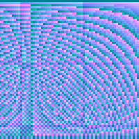

# 👋 Hi, I’m @brookman1

</img>

## 🧑‍💻 Technologist 💻

### Looking to collaborate

- There are no small projects
- 🔧Projects in a startup with 5-50ppl outside financial industry.  Retail and manufacturing are the best.
- ✔️❌Development testing to enable CI/CD
- IoT with Touchscreens

### Personal, Small Passion Projects

- 💰📉📈 Price analysis of financial instruments❤️
- 🥄data scraping
- 🏆🥇🥈🥉 Achieving more github stars and higher ⬆️ StackOverflow rating
- 🌱 I’m currently learning
  - 📊 Statistical Analysis
  - 🤖 Machine Learning / Deep Learning / Graph algorithms
- ✨㊙️There are secret projects✨
  - 📄
  - ♾️⌛🧑‍🏭⬅️🐷💄

## 👍 You Wish to Try

- 👨‍🏭Freelancer.com, [https://bit.ly/3yjFIah](https://bit.ly/3yjFIah)
  - World's largest freelancing and crowd sourcing marketplace. Connects over 52,400,900 employers and freelancers globally from over 247 countries, regions, and territories.
- 💵 Coinbase, [https://bit.ly/3ouX27z](https://bit.ly/3ouX27z)

-  This Github</img> [https://github.com/brookman1](https://github.com/brookman1)

## 📫 How to Reach Me

- 💼 LinkedIn: [https://bit.ly/3ov3Wd1](https://bit.ly/3ov3Wd1)
- 📟 Freelancer: [https://bit.ly/3bEoyKz](https://bit.ly/3bEoyKz)

## Badges and Certificates

- [https://www.hackerrank.com/ystreltsov_99](https://bit.ly/3bEoyKz)
- [Courcera](courcera.com)
- [Freelancer.com](freelancer.com)

<!---
brookman1/brookman1 is a ✨ special ✨ repository because its `README.md` (this file) appears on your GitHub profile.
You can click the Preview link to take a look at your changes.
--->
